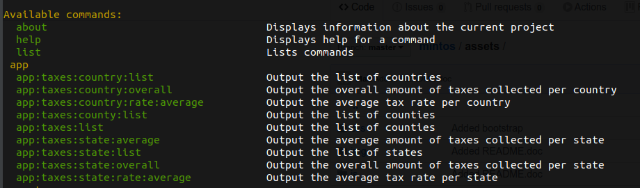
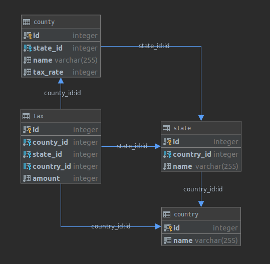

# Development task
Develop a software



### Details of the implementation
This software developed using console commands. It does not using web server since it was not required in the task description.
This software was implemented using two data sources: [sqlite|mysql]. That's why in application there is separation between entities and other classes.
Default data source is *sqlite* and it sits in the app container, *mysql* data source sits in another container. In order to use
*mysql* data source *--source=mysql* option must be specified. Default fixtures are being loaded to both data sources and in order to correctly get the data please list all countries
using console commands.
 
MVC pattern was used like this:

- Command (controller)
- Services/Utils (model)
- OutputInterface (view) 

### Details of DB schema



### Technologies used in the assessment
- Symfony 4.3
- Docker
- Docker Compose
- PHP 7.3.10
- PhpUnit 7.5.17
- Bash
- Git

### Prerequisites
Docker.io and docker-compose must be installed in the system in order to be able to use the app.
OS Linux

## How to setup the application:
```bash
git clone https://coderot@bitbucket.org/jobleads/candidate-tasks-maksym-bielushkin.git
cd candidate-tasks-maksym-bielushkin/upfront; ./toolbox.sh up
docker-compose exec app php bin/console doctrine:migrations:migrate --em=mysql
docker-compose exec app php bin/console doctrine:fixtures:load
docker-compose exec app php bin/console doctrine:fixtures:load --em=mysql
```

## How to use the application:
#### List countries
```bash
docker-compose exec app php bin/console app:taxes:country:list
docker-compose exec app php bin/console app:taxes:country:list --source=mysql
```
#### List states in selected country
```bash
docker-compose exec app php bin/console app:taxes:state:list --country=Rwanda
docker-compose exec app php bin/console app:taxes:state:list --country=Colombia --source=mysql
```
#### List counties in selected stated state in selected country
```bash
docker-compose exec app php bin/console app:taxes:county:list --country=Rwanda --state=Georgia
docker-compose exec app php bin/console app:taxes:county:list --country=Colombia --state=Alabama --source=mysql
```
#### List taxes in county, state, country
```bash
docker-compose exec app php bin/console app:taxes:list --country=Rwanda --state=Arkansas --county=Uptonberg
docker-compose exec app php bin/console app:taxes:list --country=Rwanda --state=Arkansas
docker-compose exec app php bin/console app:taxes:list --country=Rwanda
docker-compose exec app php bin/console app:taxes:list --country=Colombia --state=Alabama --county=Koeppbury --source=mysql
docker-compose exec app php bin/console app:taxes:list --country=Colombia --state=Alabama --source=mysql
docker-compose exec app php bin/console app:taxes:list --country=Colombia --source=mysql
```
#### Output the overall amount of taxes collected per state
```bash
docker-compose exec app php bin/console app:taxes:state:overall --country=Rwanda --state=Georgia
docker-compose exec app php bin/console app:taxes:state:overall --country=Colombia --state=Alabama --source=mysql
```
#### Output the average amount of taxes collected per state
```bash
docker-compose exec app php bin/console app:taxes:state:average --country=Colombia --state=Alabama --source=mysql
docker-compose exec app php bin/console app:taxes:state:average --country=Rwanda --state=Georgia
```
#### Output the average county tax rate per state
```bash
docker-compose exec app php bin/console app:taxes:state:rate:average --country=Rwanda --state=Georgia
docker-compose exec app php bin/console app:taxes:state:rate:average --country=Colombia --state=Alabama --source=mysql
```
#### Output the average tax rate of the country
```bash
docker-compose exec app php bin/console app:taxes:country:rate:average --country=Colombia --source=mysql
docker-compose exec app php bin/console app:taxes:country:rate:average --country=Rwanda
```
#### Output the collected overall taxes of the country
```bash
docker-compose exec app php bin/console app:taxes:country:overall --country=Rwanda
docker-compose exec app php bin/console app:taxes:country:overall --country=Colombia --source=mysql
```

## How to run tests
```bash
./toolbox.sh tests
```

## Basic script usage:
Application has *toolbox.sh* script. It is very easy run, stop, ssh, rebuild, run tests and stop the application.

```bash
./toolbox.sh up # run the application
./toolbox.sh rebuild # rebuild the image
./toolbox.sh ssh # ssh to the container
./toolbox.sh tests # run tests
./toolbox.sh down # stop the application
```

## Contributors
@belushkin

## License
MIT License
